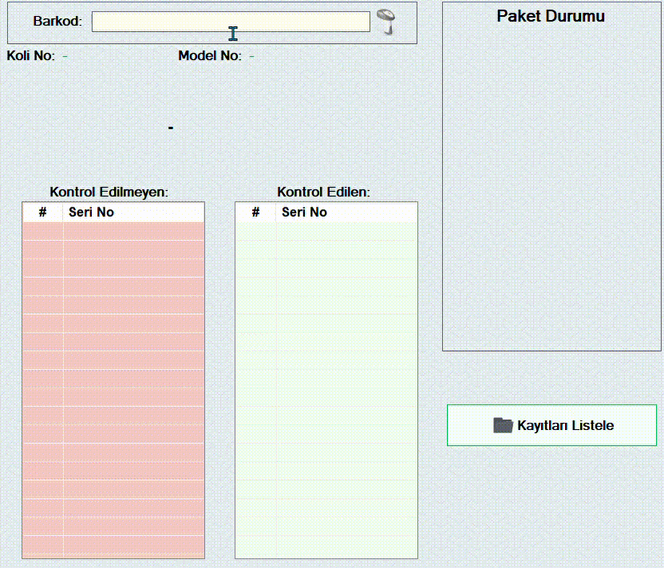
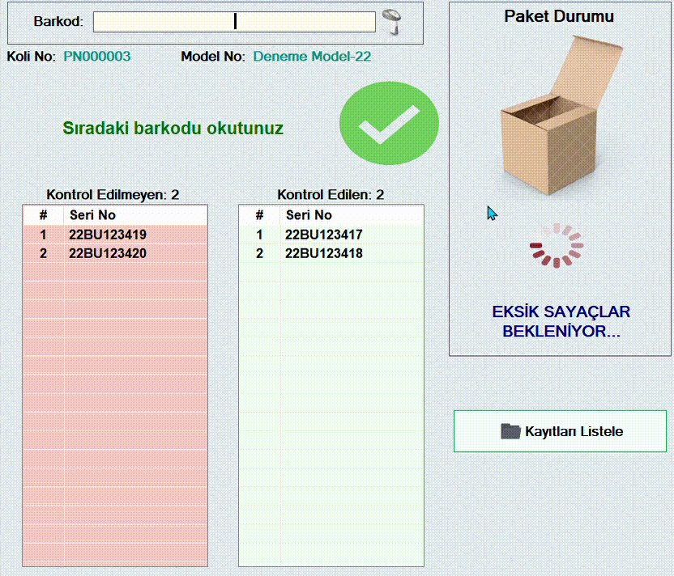
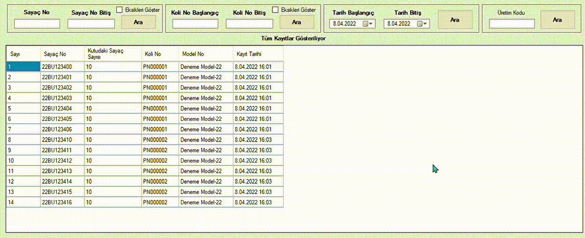

# Paket Barkod Kontrol Yazılımı

##Paketleme öncesi ürünlerin kutuya eksik yada yanlış koyulmaması için kullanılacak bir yazılımdır. Koli üzerindeki kare barkod okutululur ve database üzerinden koli içerisindeki sayaçların bilgisi ile karşılaştırılır. Bu kayıtlara göre eksik ve zaten barkod okutulan ürünler listelenir. Koli içerisindeki tüm ürünlerin barkodları okutulduğunda paketlemeye hazır olduğunu söyler. 

>Uygulama önizlemesi

>Mükerrer kayıt kontrolü yapar. Aynı numaralı ürün okutulursa ekranda uyarı verir.

 >Paketlenen ürünlerin kayıtları listelenebilmekte ve içerisinde aramalar yapılabilmektedir. Ürün kodu yada Koli kodu aralığı girerek eksik kalanları listeleyebilmekte ve kaydedebilmektedir.

